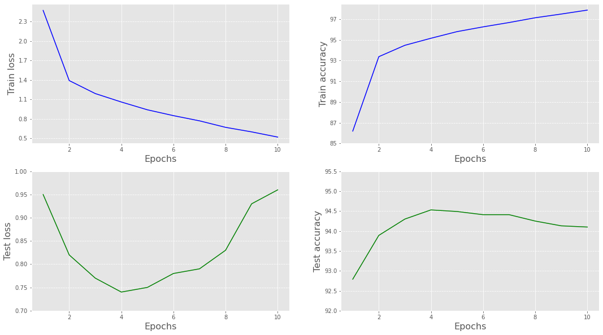
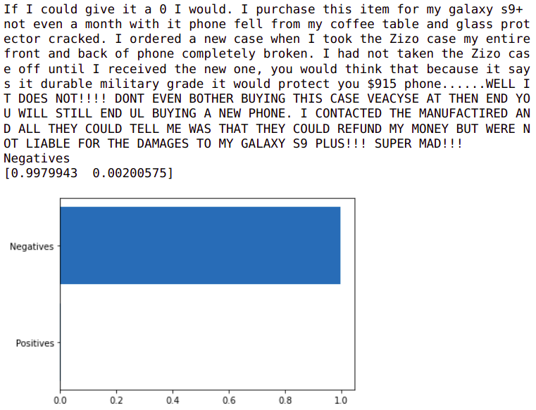
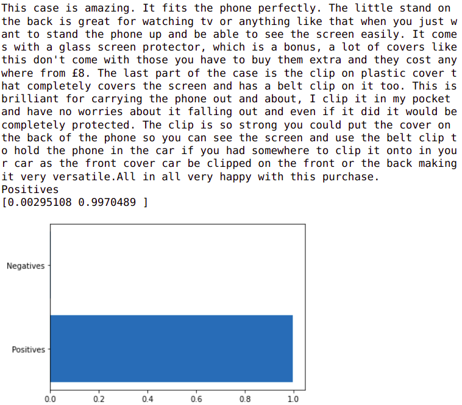
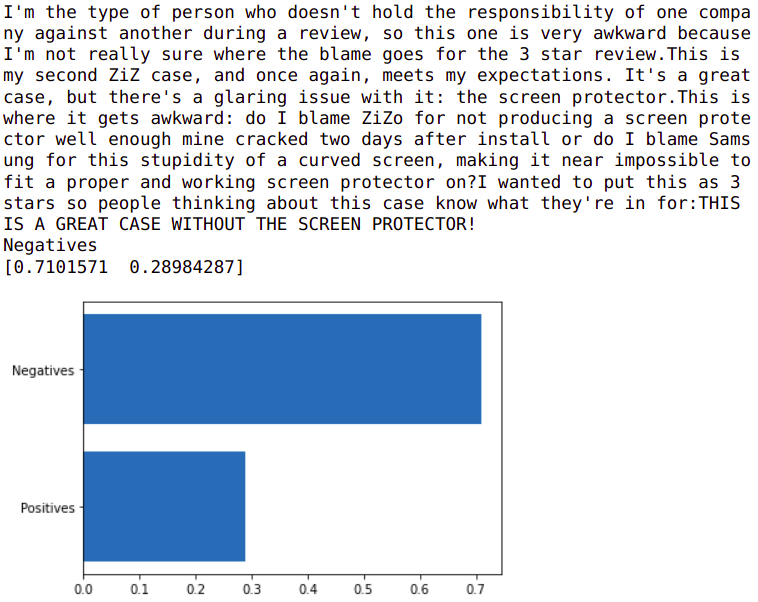

# Phân tích cảm xúc trên dữ liệu người dùng đánh giá sản phẩm trên Amazon sử dụng mạng LSTM
<p align="center">

</p>


### Nguồn dữ liệu:

Dữ liệu là các đánh giá sản phẩm trên trang bán hàng trực tuyến Amazon, được cung cấp bởi trang dữ liệu Kaggle
* Dữ liệu train: 3.6 triệu reviews
* Dữ liệu test: 400 nghìn reviews
* Số nhãn: 2

src: https://www.kaggle.com/bittlingmayer/amazonreviews?select=train.ft.txt.bz2


### Huấn luyện mô hình:

```bash
python train.py -b 500 -e 10 -l 1e-2 -f dataset
```

### Kết quả:

Kết quả tốt nhất ở Epoch 4:
* Train loss: 1.06
* Test loss: 0.74
* Train accuracy: 95.16%
* Test accuracy: 94.53%

<p align="center">

</p>


### Một số kết quả kiểm thử
**review tốt**
<p align="center">

</p>

**review không tốt**
<p align="center">

</p>

**review tốt giả**
<p align="center">

</p>
